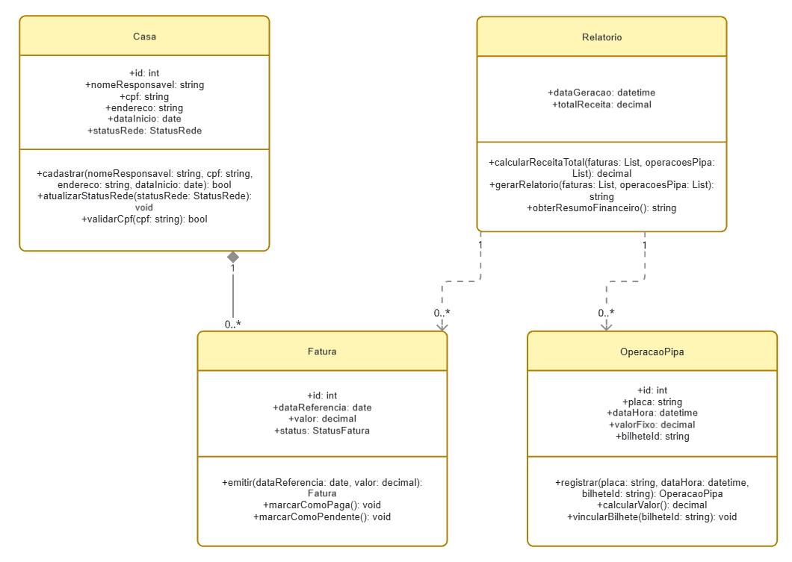

# fonte-do-pipa

# Sistema de Gestão de Fonte de Água

Este sistema foi desenvolvido como parte da disciplina de **Análise e Projetos de Sistemas (UFPB - Campus IV)**. O objetivo é fornecer uma solução integrada para o controle financeiro e operacional de uma fonte de água, abrangendo desde a gestão de clientes residenciais até o fluxo de carros-pipa.

## 🛠 Tecnologias
* **Linguagem:** Java (versão 21)
* **Paradigma:** Orientado a Objetos (POO)
* **Arquitetura:** MVC (Model-View-Controller)

## 📋 Funcionalidades Principais
1. **Gestão de Assinantes:** Cadastro de residências com validação de CPF e unicidade de endereço.
2. **Faturamento Automático:** Geração recorrente de mensalidades para casas com status "Ativa".
3. **Controle de Inadimplência:** Bloqueio automático de faturamento para residências com faturas pendentes há mais de 30 dias.
4. **Checkout de Carro-Pipa:** Registro rápido de abastecimento com valor fixo e emissão de comprovante.
5. **BI e Relatórios:** Relatório consolidado de receitas (Mensalidades + Vendas Avulsas) por período.

## 🏛 Estrutura do Domínio (Model)
O sistema é regido pelo seguinte modelo de classes:

* **`Casa`**: Gerencia o ciclo de vida da ligação e o status da rede.
* **`Fatura`**: Responsável pela lógica de recorrência e status financeiro.
* **`OperacaoPipa`**: Focada na atomicidade do registro de venda avulsa.
* **`Relatorio`**: Classe de serviço (Service) que agrega dados para análise financeira.

## 🚀 Requisitos para Desenvolvimento
1. **Java JDK 21.**
2. **Gerenciador de Dependências:** Maven ou Gradle.
3. **Banco de Dados:** Sugerido o uso de PostgreSQL ou H2 para desenvolvimento/testes.
4. **Padrão de Código:** Seguir as convenções da linguagem Java (CamelCase, encapsulamento de atributos).

## 📂 Organização das Camadas (MVC Proposto)
Para manter a organização do código:
* `/src/main/java/com/projeto/model`: Entidades (POJOs) e Lógica de Negócio.
* `/src/main/java/com/projeto/controller`: Orquestração dos fluxos e validação de regras.
* `/src/main/java/com/projeto/view`: Interfaces de interação.

---
*Projeto desenvolvido por Lucas Henrique da Silva Menezes.*
*Disciplina: Análise e Projetos de Sistemas | Professor: Dr. Dorgival Pereira da Silva Netto.*
